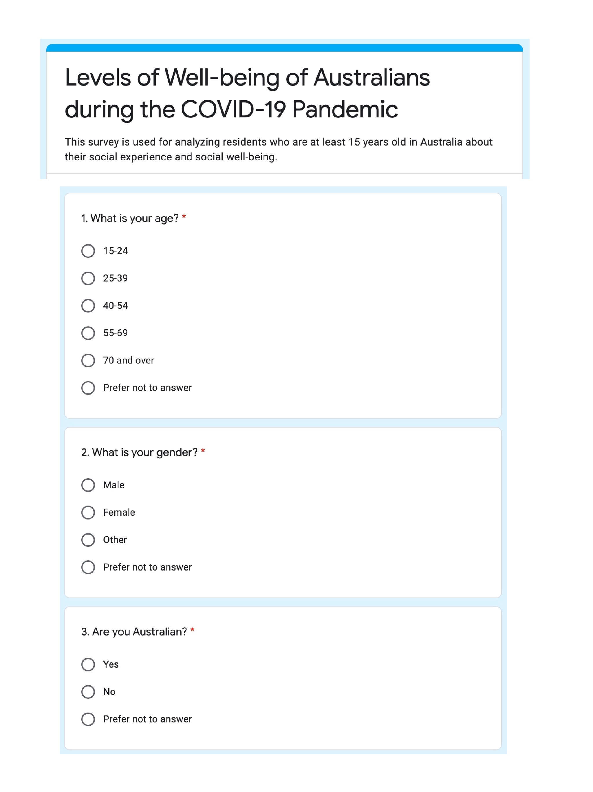
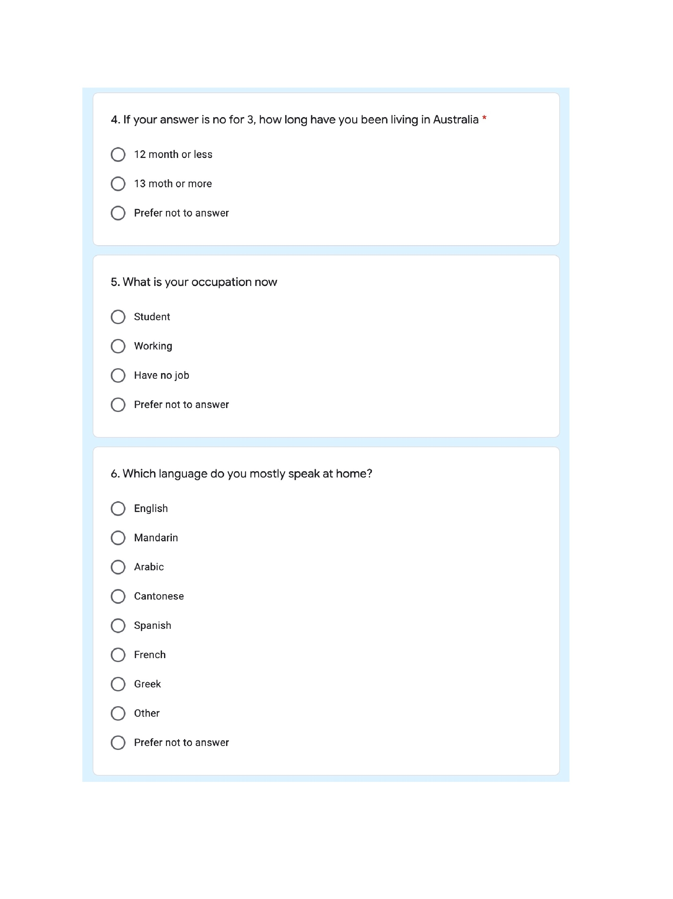
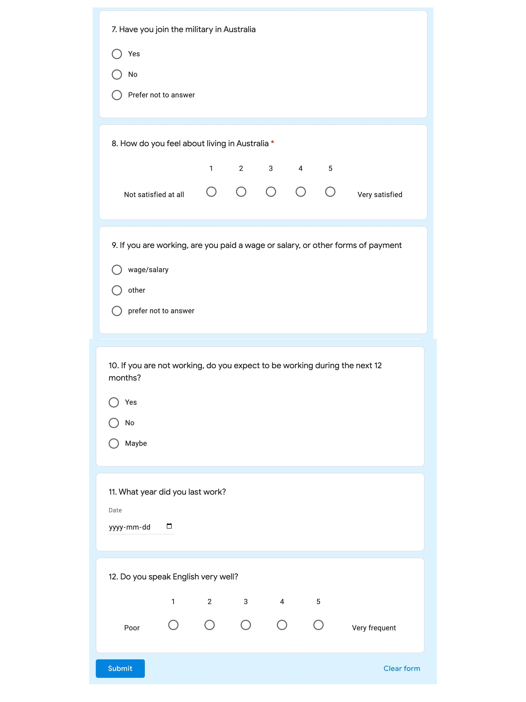

```{r setup, include=FALSE}
knitr::opts_chunk$set(echo = TRUE)
library(tidyverse)
library(dplyr)
library(data.table)
overall_lifesatisfac <- read_csv(file = "overall_lifesatisfac.csv")
rush_feeling <- read_csv(file = "rush_feeling.csv")
facecontact_age <- read_csv(file = "facecontact_age.csv")
parti_unpaid_volun <- read_csv(file = "parti_unpaid_volun.csv")
```


# Introduction

General Social Survey, also known as GSS, has 2 main purposes. One is to gather massive data from the citizens living in the country in a time to catch up with the different tendencies of social lives. The second purpose is that it can collect information that is at present a social issue for social scientists to discuss. All the surveys took target at an overall 4-month-period for all the usual residents who live in Australia with the age range from 15 and above. All areas are included in the survey except for very remote districts in Australia that have no internet or telephone access. Also, people who always live in hotels, hospitals are not counted as valid participants for the survey. There is no influence generated by omitting these people when we do the national estimate using data excluding them.

We concentrate on 4 main aspects that the GSS provides. In this study, we only care about the data collected in the year 2019 and year 2020 which is the time of the COVID-19 pandemic. Since life satisfaction is counted as a giant part of people's well-being, it is the very first aspect we want to pay attention to. The value that measures participants' life satisfaction ranges from 0 to 10. 0 represents that they are not satisfied at all and 10 represents that they are completely satisfied with their well-being living in Australia. People's stressors and rushed feelings for time are also discussed and illustrated below. We see people's face-to-face contact with their family members and friends when outside their household as a measurement of social experiences. It is also mentioned afterward. Then the unpaid voluntary work through an organization is also an important aspect we need to specify. 

We want to find a model that specifies the residents' social well-being in a mathematical equation so that we can find a way to measure the abstract concept in a concrete method. However, how do we define "well-being" and how to decide the weight of each factor that influences the response.

Section \@ref(data) introduces the input data related to gender, age groups, or year. The first plot describes the overall status of people's life satisfaction that gives an estimation of their social well-being to compare to the result of our model. Section \@ref(model) gives out the quantified equation to measure people's social well-being. In Section \@ref(results), we will demonstrate that using the model whether, in the year 2019 or 2020, residents' social wellness in Australia is better. Section \@ref(discussion), we will discuss why we allocate the factor in such a weight. Limitations of our methodology and future concerns are also included. 

# Data

Our data is of life satisfaction of people in Australia (Figure \@ref(fig:satisfaction)) in 2019 and 2020 respectively. From the figure, we can see that among all the age groups, all citizens' life satisfaction in 2019 exceeds those in the year 2020 except for people who are 70 years old or older.

```{r satisfaction, echo=FALSE, fig.cap="Overall Life Satisfaction", fig.height=4, fig.width=8, warning=FALSE}
ggplot(overall_lifesatisfac, aes(x = `Age group (years)`, y = `Life satisfaction`, fill = `Year`)) +
  geom_bar(stat="identity", position="dodge", width=.5, alpha = 0.8) + # stat = identity means I'll provide the y-value instead of letting it count
  scale_fill_manual(values = c("lightskyblue","darkslategray")) +
  theme_minimal() +
  xlab("Age Group") + 
  ylab("Life Satisfaction") 
```

Also, life satisfaction seems differ most in the age group of "15-24 years old" youth in 2019 and 2020.  

When it comes to taking gender into consideration to try to find out people's rushed feelings from time to time, there seems no significant differences between males and females.(Figure \@ref(fig:Rush))

```{r Rush, echo=FALSE, fig.cap="Feeling Rushed for the Time", fig.height=4, fig.width=8}
ggplot(rush_feeling, aes(x = `Age group (years)`, y = `Percentage of feeling rushed`, fill = `Gender`)) +
  geom_bar(stat="identity", position="dodge", width=.5, alpha = 0.8) +
  scale_fill_manual(values = c("thistle","lightsalmon")) +
  theme_minimal() +
  xlab("Age Group") + 
  ylab("Rushed Feelings") 
```
In 2019, people from all age groups are likely to contact with their family members or friends face to face living outside their household. Maximum of their difference happens in the age group of 40 to 45 years old.(Figure \@ref(fig:Face))


```{r Face, echo=FALSE, fig.cap="Face to Face Contact with Family or Friends outside household", fig.height=4, fig.width=8, warning=FALSE}
ggplot(facecontact_age, aes(x = `Age group (years)`, y = `Face to face contact`, fill = `Year`)) +
  geom_bar(stat="identity", position="dodge", width=.5, alpha = 0.8) +
  scale_fill_manual(values = c("tan2","slategray")) +
  theme_minimal() +
  xlab("Age Group") + 
  ylab("Face to face contact") 
```
Since there is no significant differences in sex, we focus more on the factor of ages. People of age 40 to the age 45 who participate in the survey do free voluntary work out of their own wills. \@ref(fig:Parti).

```{r Parti, echo=FALSE, fig.cap="Participants in Unpaid Voluntary Work through an Organization", fig.height=4, fig.width=8, warning=FALSE}
ggplot(parti_unpaid_volun, aes(x = `Age group (years)`, y = `Participation in unpaid voluntary work through an organisation (%)`)) +
  geom_bar(stat="identity", position="dodge", width=.5, alpha = 0.8) +
  theme_minimal() +
  xlab("Age Group") + 
  ylab("Participants") 
```

# Model

\begin{equation}
$$PWB = (LS + TI) / RR $$(\#eq:model)
\end{equation}

$PWB$ represents personal social well-being;
$TI$ represents individual's total net influence of various activities;
$RR$ stands for response rate of the questionnaire

# Results

After careful calculation, in 2019, the LS is 7.58, TI is 68.4. In 2020, the LS is 7.2, and TI is 43.4. With the formula provided in the model part, we have that the personal social well-being value is 124.97 in 2019 and 83.22 in 2020. Thus, we can state that in 2019 residents in Australia have better social experience than in 2020. Females compares to males are more likely to feel rushed from time to time.

# Discussion

The General Social Survey(GSS) collected data with around 5304 samples in Australia. The survey was meant to provide general information to the government and institutions to analyze and then help them allocate resources better and give advice to individuals when talking about their social lives. It attempts to cover relevant social characteristics social experiences that provide a complete view of the residents in Australia. The survey focuses more on broad topics that affect numerous aspects instead of digging in-depth to find a specific answer to a social problem. 

The survey participants should be all the residents who live in Australia in both populated areas and remote rural territories. Visitors to those areas are not counted as valid samples in this survey. In addition, international travelers who plan to live, work or study in Australia for the next 12 months or above are contained in the sample. Only people who live in hotels and hotel-like non-private dwellings and very remote places are excluded from the data. There is also an age limit request in the sample. Citizens who participate ought to be 15 years old or older. The samples are randomly selected in every household to minimize the sampling error at the very beginning of the survey. To show respect to the teenagers, if they are between 15 to 17 years old, we also want to consider their parents' opinions. We tend to pick samples in the areas that are not sensitive to social and economic influences so that the probability of the whole population we want to estimate using the data is fair. 

The questionnaires are gathered via internet or telephone interviews due to the spread of coronavirus in the pandemic. Among the 5304 participants, only 60.5% of them respond fully to the survey. The non-responding rate in 2020 is higher than that in 2019 since if a household does not reply, we don't count him as a valid sample. If a home is opted to join the survey in selected areas, then a letter will send to them to tell them to participate online or through phone call. The GSS survey contains two parts. One is for the whole family, i.e., one responsible adult will fill the form in the household, and the other is for individuals at least 15 years old. As for not completed forms, the missing values will be seen as 'Don't know'. 

## Process calculation

Since there is no way to collect the population data, the answers of these samples are seen as an estimator of the whole population, which is called weighting in statistics. The number of people living in the selected sampling household is the weight of the household's proportion in the sample. Furthermore, everyone has an initial probability of being selected. The survey also considers the probability significant to estimate the number of 20269036 people(the population). 

To ensure the estimate is reliable, we need to minimize sampling and non-sampling errors. Sampling error is the statistical error that happens if the sample we choose cannot fully represent the entire population, leading to an incorrect estimate of the population characteristics. The non-sampling error will influence the data accuracy through irrelevant factors for the sample. In the GSS, misunderstanding of the survey questions and incorrect records of answers in telephone interviews will lead to non-sampling errors. Standard error and relative standard error can measure the sampling error. 

## Questionnaire

The questionnaire's content consists of topics of the individual's financial situation, health concern, discrimination. For each aspect, there is a small module for participants to fill. The first module of the survey investigates the qualification of the person who fills the form. If they are not qualified, there is no need for them to continue the survey. They are not the target. 
Only after they fulfill the target request will they start questions about their personal social experience. It might be better to conclude questions about the number of their contacts and satisfaction towards them.

## Weaknesses and next steps

However, our findings might contain some limitations. When it comes to samples we take, only 60.5% of the households respond fully to the survey. We also exclude persons who live in remote rural areas and those communities that are not capable to connect themselves to the internet or telephone interviews. They account for around 21% of the population. Thus, there exists a bias towards the participants we randomly choose. Furthermore, the GSS only collected a period of 4-month data of a sample of people in Australia. Hence, during the process of transforming the observations into the whole population, the weighting of households that represents the opinion of the family could not be fully reliable due to the households' young age.

For future study, we might consider including the remote area observations if applicable to reduce the measures of error. Also, to add more describable questions to the questionnaire to replace some of the multiple choices to enrich the content.

\newpage

\appendix

# Appendix {-}


 

\newpage



\newpage




# Additional details

People who tend to participate should not be forced to answer questions they do not want to. The survey will be anonymous, and we will not use the survey result to gain profit.

\newpage

# References
@citeR
@thereferencecanbewhatever
@citeLahman
@citeABS
